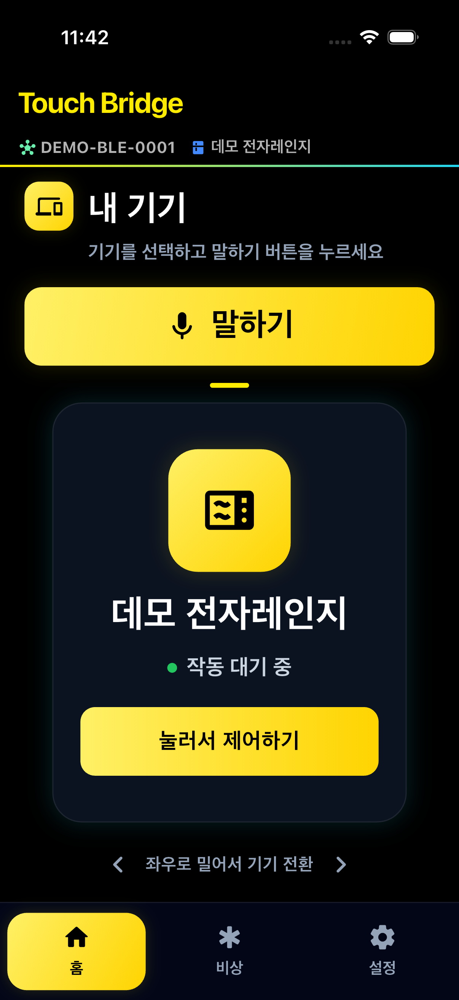
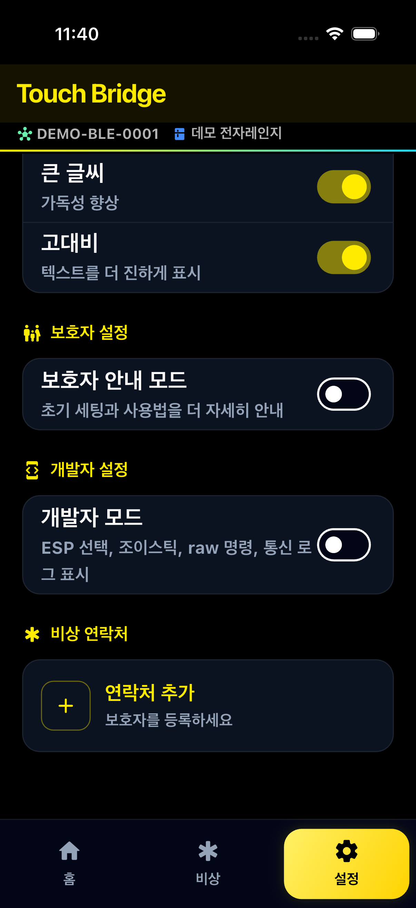
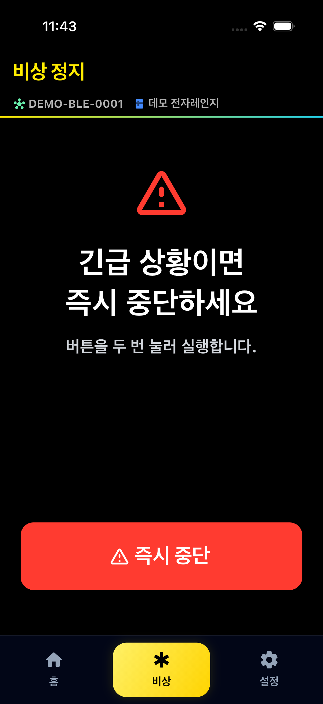

# Touch Bridge

**시각장애인을 위한 가전 터치패드 자동 입력 시스템**

> 2026 한이음 드림업 공모전 — 3팀 멜론머스크 (박성원 · 서예솔)  

---

## 왜 이 문제인가

> 2024년 장애인차별금지법 이행 실태조사에서 시각장애인 응답자의
> **77.1%**가 편의 기능 미비·부족으로 키오스크 이용에 어려움을 겪었다고
> 답했습니다. ([보건복지부 자료 KDI 보관본](https://eiec.kdi.re.kr/policy/materialView.do?num=269629))

국내 등록 시각장애인은 약 **24만 7천 명**입니다
([보건복지부 2024년 등록장애인 현황](https://www.mohw.go.kr/board.es?mid=a10503000000&bid=0027&list_no=1485363&act=view)).
전자레인지·세탁기·인덕션 등의 평면 터치패널은 버튼 위치를 촉각만으로
구분하기 어렵습니다.

- **기존 대안의 한계**: LG·삼성의 점자 스티커·음성 매뉴얼은 여전히 *정확한 위치를 사용자가 직접 터치*해야 합니다.  
- **스마트홈 가전 교체**: 비용이 크고, 이미 집에 있는 가전은 그대로 못 씁니다.

Touch Bridge는 **교체가 아닌 부착**으로 기존 가전을 그대로 접근성 있게 만듭니다.  
물리 터치 대행 방식은 UIST 2023
[BrushLens 원 연구](https://dl.acm.org/doi/10.1145/3586183.3606730)에서도
검토된 접근법입니다. 논문의 실험 결과는 Touch Bridge의 실기 성능을 의미하지
않으며, 본 프로젝트 수치는 별도 반복 시험으로 검증합니다.

---

## 프로젝트 개요

전자레인지·세탁기·키오스크 등 터치패널 기반 가전이 시각장애인에게 접근하기 어렵다는 문제를 해결합니다.  
가전 터치패드 위에 부착하는 **IoT 하드웨어 장치**가 스마트폰 앱·음성 명령을 받아 **물리적으로 버튼을 대신 눌러주는** 시스템입니다.

---

## 데모 화면

<table>
  <tr>
    <td align="center" width="25%"><br><b>홈 · 내 기기</b><br><sub>큰 말하기 버튼 · 현재 기기</sub></td>
    <td align="center" width="25%"><br><b>제어 방식 선택</b><br><sub>음성·이미지·코스·숫자패드</sub></td>
    <td align="center" width="25%"><br><b>비상 정지</b><br><sub>즉시 중단 · 이중 확인</sub></td>
    <td align="center" width="25%"><br><b>접근성 · 모드</b><br><sub>큰 글씨·고대비·보호자/개발자</sub></td>
  </tr>
</table>

> 고대비 다크 테마 · 큰 터치 영역 · **2단계 탭**(첫 탭 안내 → 둘째 탭 실행) · 하단 3탭(홈 / 비상 / 설정) 구조.
> (스크린샷은 데모 데이터 기준)

---

## 주요 기능

### 음성 명령 (STT + Gemini AI)
- `speech_to_text`로 음성 수집 → 백엔드/Gemini로 의도 파싱
- 지원 명령: 기기 작동(초 단위), 비상 정지, 화면 이동(NAVIGATE), 상태 질의("얼마나 남았어?"), 재실행("아까 그거 다시" — 확인 후 실행)
- 기기 별명 지원: "우리집 세탁기"처럼 평소 부르는 이름으로 호출 가능 (기기 관리에서 등록)
- 침묵 감지 타임아웃 5~15초 — 설정에서 개인 맞춤 조절 가능
- STT 연속 실패 시 에스컬레이션: 2회 실패 → "도움말" 힌트 자동 안내

### TTS 음성 안내
- 모든 화면 진입·버튼 탭·완료 시 한국어 음성 피드백
- 속도·음량 설정 저장 (SharedPreferences)
- TalkBack/VoiceOver 활성 시 이중 낭독 자동 억제

### 비상 정지
- **전역 비상 버튼**: 모든 화면 상단 앱바에 상주 — 어떤 화면에서든 두 번 탭이면 즉시 중단
- 버튼 3초 홀드(1초 간격 햅틱 피드백) 또는 음성 "멈춰"/"정지"/"그만"
- 카운트다운 구간(5분·2분·1분·30초·10초·5초·3초) 자동 음성 안내
- 정지 결과는 하드웨어 ACK 확인 기반으로만 "멈췄습니다" 안내 (거짓 완료 금지)

### 이중 탭(2단계) 확인 패턴
- 하드웨어를 실제로 누르는 모든 동작은 **첫 탭에서 안내 + 대기 강조, 둘째 탭에서 실행** (오작동 방지)
- 전 화면 일관 적용 (제어 시트·이미지 제어·간편 코스·숫자 패드·비상 정지)
- 대기(armed) 시간 **20초** (WCAG 2.2.1 준수)

### 사용자 / 보호자 모드 분리
- **사용자 모드** (기본): 일상 조작은 홈·비상 정지·설정에 집중하되, 독립 설치가 필요한 사용자는 홈의 명시적 진입점에서 기기를 추가할 수 있음
- **보호자 모드**: 기기 관리 탭과 연결·매핑 도구를 추가 노출 — 가족·시설 관리자의 초기 설정과 유지보수에 적합

### Gemini Vision 버튼 자동 매핑
- 가전기기 사진 촬영 → Gemini Vision API로 버튼 위치 인식
- 버튼 중심 정규화 좌표를 생성하고, 네 모서리 캘리브레이션으로 실제 X/Y mm 좌표로 변환
- 드래그 외에도 상·하·좌·우 미세 조정 버튼으로 위치를 수정하고 한 점씩 검증 가능
- 기기별 독립 저장 (deviceId 기반)

### 설정 영속화
- TTS 속도·음량, STT 타임아웃, 접근성 옵션 → 앱 재시작 후에도 유지

---

## 기술 스택

| 분류 | 패키지 | 버전 |
|------|--------|------|
| 프레임워크 | Flutter / Dart | 3.x / 3.x |
| 음성 인식 | `speech_to_text` | ^7.4.0 |
| TTS | `flutter_tts` | ^4.2.5 |
| AI (NLU + Vision) | `google_generative_ai` (백엔드 프록시) | ^0.2.0 |
| BLE 통신 | `flutter_blue_plus` | ^1.35.5 |
| NFC 태그 | `nfc_manager` | ^3.3.0 |
| 전화 연결 | `url_launcher` | ^6.3.1 |
| 사진 선택 | `image_picker` | ^1.1.2 |
| 설정 저장 | `shared_preferences` | ^2.3.2 |
| 환경 변수 | `flutter_dotenv` | ^5.1.0 |

---

## 플랫폼 지원

| 기능 | Android | iOS | macOS 앱 | Chrome (웹) |
|------|:-------:|:---:|:--------:|:-----------:|
| TTS 음성 안내 | ✅ | ✅ | ❌ * | ✅ |
| STT 음성 명령 | ✅ | ✅ | ❌ * | ✅ |
| Gemini AI | ✅ | ✅ | ✅ | ✅ |
| 사진 매핑 | ✅ | ✅ | ✅ (갤러리) | ✅ |
| 설정 영속화 | ✅ | ✅ | ✅ | ✅ |

> \* macOS 26 (Tahoe) beta OS 버그로 TTS/STT 비활성화. 정식 출시 후 재확인 예정.

---

## 환경 설정

### 앱(Flutter)
프로젝트 루트 `.env`:

```env
AI_BACKEND_URL=http://127.0.0.1:8000
# 백엔드에 BACKEND_API_KEY가 설정된 경우 같은 값 지정
AI_BACKEND_API_KEY=
```

앱은 Gemini API 키를 직접 사용하지 않고, 백엔드 API를 통해 AI 기능을 호출합니다.
(`.env_ex` 참고)

### 백엔드(FastAPI)
`backend` 실행 환경 `.env`:

```env
# AI 제공자 선택: google(기본, Gemini 직접 호출) | school(수원대 API Gateway)
# school 선택 시 실패해도 Google로 자동 우회하지 않습니다.
AI_PROVIDER=google

# google 제공자용
GOOGLE_API_KEY=여기에_실제_키_입력
GEMINI_MODEL=gemini-1.5-flash

# school 제공자용 (수원대학교 API Gateway, OpenAI 호환)
SCHOOL_API_KEY=
SCHOOL_API_BASE_URL=https://factchat-cloud.mindlogic.ai/v1/gateway
SCHOOL_API_MODEL=gemini-3.8-flash
# 사진 분석용 모델을 따로 쓰려면 지정 (미지정 시 SCHOOL_API_MODEL과 동일)
SCHOOL_API_VISION_MODEL=

# 배포 시 필수 — 설정하면 모든 API 요청에 X-API-Key 헤더를 요구합니다
BACKEND_API_KEY=
# MongoDB (미설정 시 localhost, 연결 실패 시 인메모리 폴백)
MONGO_URI=mongodb://localhost:27017/
```
(`backend/.env_ex` 참고)

#### Render 배포 (학교 API Gateway 사용 시)
1. Render 서비스의 Environment에 다음 변수를 설정:
   - `AI_PROVIDER=school`
   - `SCHOOL_API_KEY=<학교 발급 키>` (Git/예제 파일에 절대 넣지 말 것)
   - `SCHOOL_API_BASE_URL=https://factchat-cloud.mindlogic.ai/v1/gateway`
   - `SCHOOL_API_MODEL=gemini-3.8-flash`
   - (선택) `SCHOOL_API_VISION_MODEL=<사진 분석용 모델 ID>`
   - `BACKEND_API_KEY=<앱과 공유할 서버 인증 키>`
2. 코드 변경을 push하면 Render가 자동 재배포합니다 (수동이면 Manual Deploy →
   Deploy latest commit).
3. 배포 확인 순서:
   - `GET /` 응답의 `ai_provider`가 `school`인지 확인 (설정 확인용일 뿐,
     **AI 연결 성공의 증거는 아님** — `/healthz` 200도 마찬가지)
   - `/parse-command`에 규칙에 없는 문장(예: "안녕하세요")을 보내고,
     Render 로그에서 `ai.call provider=school model_req=... model_resp=...
     status=ok` 라인으로 실제 학교 API 사용을 확인
4. 사진 분석(`/vision-mapping`)의 게이트웨이 지원은 **미검증** — 소량 테스트로
   확인하고, 실패 시 `SCHOOL_API_VISION_MODEL`을 모델 목록의 다른 멀티모달
   모델로 바꿔 재시도하세요. (게이트웨이는 제공자 네이티브 전체 API를 지원하지
   않으며, 모델 이름만으로 사진 지원을 확정할 수 없음)

> 백엔드에는 IP당 분당 60회(비전 10회) 레이트리밋, 업로드 5MB 상한,
> AI 응답 스키마 검증(버튼 ID 화이트리스트 등)이 적용되어 있습니다.

---

## 실행 방법

```bash
# 의존성 설치
flutter pub get

# Chrome에서 실행 (개발·테스트 권장)
flutter run -d chrome

# Android
flutter run -d android

# iOS
flutter run -d ios
```

> Chrome 첫 실행 시 마이크 권한 팝업이 뜹니다. 허용해야 음성 명령이 동작합니다.  
> TTS는 첫 사용자 탭 이후부터 작동합니다 (Chrome 자동재생 정책).

---

## 플랫폼별 권한 설정

### Android (`android/app/src/main/AndroidManifest.xml`)
```xml
<uses-permission android:name="android.permission.RECORD_AUDIO"/>
<uses-permission android:name="android.permission.INTERNET"/>
<uses-permission android:name="android.permission.CAMERA"/>
<uses-permission android:name="android.permission.READ_MEDIA_IMAGES"/>
```

### iOS (`ios/Runner/Info.plist`)
```xml
<key>NSMicrophoneUsageDescription</key>
<string>음성 명령을 듣기 위해 마이크 접근이 필요합니다.</string>
<key>NSSpeechRecognitionUsageDescription</key>
<string>음성 명령을 텍스트로 인식하기 위해 권한이 필요합니다.</string>
<key>NSCameraUsageDescription</key>
<string>가전기기 버튼을 AI로 인식하기 위해 카메라 접근이 필요합니다.</string>
<key>NSPhotoLibraryUsageDescription</key>
<string>기기 사진을 선택하여 버튼을 매핑하기 위해 사진 라이브러리 접근이 필요합니다.</string>
```

### macOS (`macos/Runner/Info.plist` + entitlements)
- Info.plist: NSMicrophoneUsageDescription, NSSpeechRecognitionUsageDescription, NSCameraUsageDescription, NSPhotoLibraryUsageDescription
- Entitlements: audio-input, speech-recognition, photos-library, camera, network.client

---

## 프로젝트 구조

```
lib/
├── main.dart                              # 앱 진입점, dotenv·설정 로드
├── screens/
│   ├── main_navigation_screen.dart        # 사용자/보호자 모드별 하단 내비게이션
│   ├── home/home_screen.dart              # 기기 카드 스와이프 (PageView)
│   ├── control/remote_control_screen.dart # 타이머 제어 키패드
│   ├── voice/voice_listening_screen.dart  # STT + Gemini AI 음성 명령
│   ├── safety/
│   │   ├── emergency_stop_screen.dart     # 비상 정지 (3초 홀드 / 음성)
│   │   └── stop_done_screen.dart          # 정지 완료 확인
│   ├── settings/
│   │   ├── settings_screen.dart           # 접근성·연락처·보호자/개발자 설정
│   │   ├── device_management_screen.dart  # 보호자용 기기 관리
│   │   └── developer_console_screen.dart  # 개발자용 ESP/G-code/XYZ 테스트
│   ├── connection/
│   │   ├── device_connect_screen.dart     # 기기 연결 (QR/BLE/NFC)
│   │   └── qr_scan_screen.dart            # QR 스캔
│   └── mapping/photo_mapping_screen.dart  # Gemini Vision 버튼 매핑
├── services/
│   ├── tts_service.dart                   # TTS Singleton
│   ├── accessibility_settings.dart        # 설정 Singleton + SharedPreferences
│   ├── device_mapping_service.dart        # 기기별 매핑/XYZ 모션 프로필 저장
│   ├── mapping_execution_service.dart     # BT-xx → X/Y/Z G-code 실행 변환
│   ├── ble_service.dart                   # BLE 스캔/연결/raw 명령 전송
│   └── timer_service.dart                 # 카운트다운 타이머
├── theme/                                 # 고대비 다크 테마
└── widgets/                               # 재사용 위젯
```

---

## Gemini AI 명령 형식

```json
{
  "action": "MICROWAVE_CONTROL | EMERGENCY_STOP | NAVIGATE | NONE",
  "device": "전자레인지",
  "seconds": 30,
  "commands": ["BT-02", "BT-05"],
  "target": "connection | mapping | settings",
  "message": "알겠어요. 전자레인지 30초 돌릴게요."
}
```

---

## 하드웨어 연동

현재 하드웨어 방향은 소형화를 위해 **FIT0482 엔코더 DC 기어모터 2개(X/Y) + ESP32 폐루프 PID + 스위치봇 누름부**로 전환하는 것입니다. 상세 구현 순서는 [`docs/XY_SWITCHBOT_SOFTWARE_PLAN.md`](docs/XY_SWITCHBOT_SOFTWARE_PLAN.md)를 따릅니다.

**현재 구성:**
- X/Y: `FIT0482` 6V 310RPM 50:1 엔코더 DC 기어모터 2개
- 제어: ESP32가 엔코더 피드백을 받아 축별 위치 PID 수행
- 원점: X/Y 리미트 스위치; 홈 완료 전 이동 금지
- 누름: 별도 Z축 대신 스위치봇 사용
- 통신: 앱 → BLE/Wi-Fi → ESP32
- 전원: 모터 전원과 MCU 전원 분리, 공통 GND 유지

**권장 실행 흐름:**
- AI는 물리 좌표를 만들지 않고 논리 버튼 ID(`BT-xx`)만 반환합니다.
- 사진 분석은 버튼 중심의 정규화 좌표와 신뢰도만 만들고, 보호자 캘리브레이션을 거쳐 X/Y mm로 확정합니다.
- 앱은 `BT-xx → buttonMachinePositions → X/Y 목표 mm`를 전달합니다.
- ESP32는 목표 위치 오차가 허용 범위 안에 들어온 뒤에만 스위치봇을 작동시키고 완료 상태를 회신합니다.
- 현재 앱의 GRBL XYZ G-code와 `BTN_n`, `SET_GRID`, `PRESS x y`는 v2 펌웨어 확정 전까지 레거시 호환 경로로만 유지합니다.

**v2 명령 예시(초안):**
```json
{
  "version": 2,
  "commandId": "uuid",
  "action": "move_and_press",
  "target": {"xMm": 42.5, "yMm": 18.25},
  "pressActuator": "switchbot"
}
```

---

## 개발 현황

- [x] 사용자/보호자 모드별 하단 내비게이션 + 이중 탭 확인 패턴
- [x] TTS Singleton (설정 영속화)
- [x] STT + Gemini AI 음성 명령 (침묵 감지 포함)
- [x] 비상 정지 (홀드 / 음성 / 카운트다운)
- [x] Gemini Vision 버튼 자동 매핑
- [x] SharedPreferences 설정 저장
- [x] 웹(Chrome) 지원
- [x] Android·iOS·macOS 권한 설정
- [x] BLE 연동 1차 (`flutter_blue_plus`: 스캔/연결/명령 전송)
- [x] immutable `deviceId` 기반 기기 관리 + 기존 name 기반 매핑 자동 마이그레이션
- [x] API 키 클라이언트 분리 (앱→백엔드 프록시, Gemini 키 서버 보관)
- [x] NFC 태그 기기 등록 (`nfc_manager` — 시각장애인에게 QR보다 적합한 비시각 방식)
- [x] 비상 연락처 실제 전화 연결 (`url_launcher` tel:)
- [ ] QR 스캔 재활성화 (`mobile_scanner` 의존성 제거로 현재 비활성 — 화면은 정직한 안내로 대체)
- [x] 버튼 매핑 데이터 영속화
- [x] 기기 목록 동적 관리
- [x] 디자인 토큰 확장(보조 강조색/그라디언트) + 공용 위젯·핵심 화면 비주얼 리뉴얼 (2026-06-27)
- [x] 대형 화면/서비스 파일 구조 분리 — `voice_listening_screen`, `home_screen`, `photo_mapping_screen`, `ble_service`, `developer_console_screen`, `manual_mapping_screen` 등을 책임별 위젯/서비스 파일로 분리 (2026-06-27)
- [x] `home_devices` 저장소를 6곳 중복 코드에서 `HomeDeviceStore` 서비스로 단일화 (2026-06-27)
- [x] 기본 사용자 모드 시작, 보호자/개발자 기능 격리
- [x] `BT-xx → X/Y/Z G-code` dry-run 변환 및 개발자 콘솔 로그
- [x] 개발자 콘솔 `$H`, `STOP`, Z축 테스트, 작은 화면 반응형 보강
- [x] **접근성 고도화 Phase 1-7 (2026-08)** — WCAG 2.2 AA/AAA + KS X 3253 준수
  - ExcludeSemantics / CustomSemanticsAction / liveRegion / heading / Semantics value 전 화면 적용
  - TalkBack PageView 잠금 + 대체 탐색 버튼, BottomSheet 자동 포커스
  - WCAG 2.2.1 이중 탭 타임아웃 20초 통일, 200% 폰트 대응 minHeight 6곳
  - 색상 대비 자동 검증 테스트 (`AA ≥4.5:1` / `AAA ≥7:1`)
  - 비상정지 홀드 1초 간격 햅틱, 카운트다운 구간 TTS (5분→3초)
  - BLE 자동 재연결 지수 백오프 (2→4→8초), BleStatusBanner liveRegion
  - STT 침묵 타임아웃 설정화 (5~15초 슬라이더), 연속 실패 에스컬레이션
  - NAVIGATE 음성 액션 구현 (설정·기기 연결·버튼 매핑 화면 이동)
  - 세탁기·에어컨 음성 명령 BLE 전송 연결 (`ApplianceCommandRouter`)
  - 첫 방문 예시 명령어 자동 낭독, 첫 실행 AlertDialog 온보딩
  - 당시 단위 테스트 160개+ (BLE 재연결 16 + 가전 라우터 25 + 색상 대비 + STT 타임아웃)
- [x] **전면 리뷰 후속 안정화 15단계 (2026-08-20~21)** — 상세: [`docs/WORK_LOG.md`](docs/WORK_LOG.md)
  - 스크린리더 TTS 억제 계약 확정(비상·결과 안내 항상 재생), 확인 질문 후 자동 재청취
  - Z축 하강 후 실패 시 자동 복구, 매핑 셀 충돌 검출·저장 차단, 수동 매핑 병합 저장
  - 가짜 동작 제거/실구현: 비상 연락처 실제 전화(tel:), NFC 태그 등록, 고정 30초 타이머 제거
  - BLE 명령 직렬화 큐 + 응답 waiter 선등록, 연결/끊김 이벤트 신뢰성, 물리 동작 인증 게이트
  - 공용 STT 세션(화면 간 이벤트 오염 방지), 백엔드 API 키·레이트리밋·AI 응답 스키마 검증
  - 이중 탭 타임아웃 20초 단일 상수화, 문서 계보 복구(HARDWARE_MIGRATION_PLAN 등)
  - 당시 단위 테스트 224개로 확장 (보안 세션·명령 큐·Z 복구·셀 충돌·매처 등 무테스트 영역 해소)
- [x] **FIT0482 X/Y + 스위치봇 소프트웨어 M1~M5 (2026-09-04)** — 버튼별 실제
  mm 좌표와 4점 투영 보정, ESP32 모션 v2 상태 머신, 원점/위치 토큰 안전 게이트,
  한 점씩 검증·실측 오차 기록, 촬영 전 방향 안내, 드래그 대체 미세 조정 버튼,
  화면읽기 단순 내비게이션 확인 최적화. 상세:
  [`docs/XY_SWITCHBOT_SOFTWARE_PLAN.md`](docs/XY_SWITCHBOT_SOFTWARE_PLAN.md)
- [ ] ESP32 모션 v2 펌웨어 구현 및 FIT0482 실기 PID/ACK 검증
- [ ] 전맹·저시력 참여자를 분리한 실제 과업 평가
- [ ] BLE 실기기 E2E 검증 (sendPress / sendEmergencyStop ACK)
- [x] 기기별 4점 X/Y 투영 캘리브레이션 UI와 버튼별 실제 mm 저장

---

## 작업 로그

자세한 변경 이력은 [`docs/WORK_LOG.md`](docs/WORK_LOG.md)를 참고하세요.

## 심사용 문서

- [심사 요약서](docs/JUDGING_BRIEF.md)
- [3분 데모 스크립트](docs/DEMO_SCRIPT_3MIN.md)
- [재현 가이드/런북](docs/REPRO_RUNBOOK.md)
- [접근성 지침·법률 조사 (WCAG 2.2 / KS X 3253 / 장애인차별금지법)](docs/ACCESSIBILITY_GUIDELINES_RESEARCH.md)
- [2026-09-04 근거자료 출처 감사](docs/SOURCE_AUDIT_2026-09-04.md)
- [시각장애인 당사자 검증 계획/기록 양식](docs/USER_VALIDATION_PLAN.md)
- [FIT0482 X/Y + 스위치봇 소프트웨어 계획](docs/XY_SWITCHBOT_SOFTWARE_PLAN.md)
- [앱-하드웨어 연동 계약서 (BLE/Wi-Fi, XYZ G-code, 레거시 명령)](docs/HW_APP_INTEGRATION_CONTRACT_KO.md)
- [하드웨어 마이그레이션 계획서](docs/HARDWARE_MIGRATION_PLAN.md)
- [하드웨어 작업 및 안전 체크리스트](docs/HARDWARE_TASKS.md)
- [AI 시스템 통합 가이드](docs/AI_SYSTEM_OVERVIEW_KO.md)

## 테스트

```bash
flutter analyze
flutter test
```

- Flutter 자동 테스트 **318개 통과 (2026-09-06)**: 명령 규칙, 시간 계산, 실제 mm 좌표·4점 보정,
  ESP32 모션 v2 상태 머신, 안전 검증 기록, BLE 재연결·명령 큐, 보안 세션(HMAC),
  Z축 복구, 셀 충돌 검출, TTS 억제 계약, 화면읽기 내비게이션, 촬영 안내,
  보호자 자유 배치·조이스틱 위치 맞추기, 드래그 대체 조그, 색상 대비(WCAG), STT 타임아웃
- 9월 5일 안전 회귀 10건: 보정 무효화 실행 차단·영속화, 정지 후 대기 작업/지연
  응답 폐기, 대기 중 재연결, 원점 기기 구분, 타임아웃 안내, 화면 종료 처리.
- 위젯 테스트: 홈 화면 스모크, BLE 연결 흐름, 하단 내비게이션 모드 전환

## 접근성 실험 지표

설정 화면의 `접근성 실험 지표` 섹션에서 다음 항목을 누적 확인할 수 있습니다.
- 총 작업 수 / 완료 / 중단 / 완료율 / 평균 완료 시간
- 음성·수동 **모드별 분리 집계** (작업 수, 완료 수, 평균 완료 시간 — 당사자 검증의 핵심 비교 지표)
- 비상 정지 횟수 / 이중탭 타임아웃 횟수

`지표 내보내기`로 CSV를 클립보드에 복사해 시트에 붙여 넣을 수 있고,
`지표 초기화`(확인 다이얼로그)로 실험 배치를 리셋할 수 있습니다.

---

## 하드웨어 작업 및 안전 (요약)

하드웨어는 프로토타입 수준에서 동작하지만, 설치·운영 전 반드시 물리적 안전 조치를 수행해야 합니다. 자세한 체크리스트와 회로 권장 사항은 `docs/HARDWARE_TASKS.md`를 먼저 확인하세요.

간단히 확인해야 할 항목:
- FIT0482 X/Y 모터 2개의 실측 정지전류를 기준으로 H-브리지와 전류 제한을 선정
- 6V 모터 전원과 ESP32 로직 전원을 분리하고 공통 GND 연결
- 엔코더 A/B상 방향·카운트와 X/Y 리미트 스위치의 fail-safe 동작 확인
- 홈 완료 전 이동 금지, 허용 오차 밖에서는 스위치봇 누름 금지 확인
- 적정 퓨즈 장착
- 하드웨어 비상정지(E‑STOP) 회로 구성(필수)

보안 관련 권장사항은 `docs/SECURITY.md`에 정리되어 있습니다. 프로덕션 전환 전 BLE LE Secure Connections 및 OTA 서명 도입을 권장합니다.

