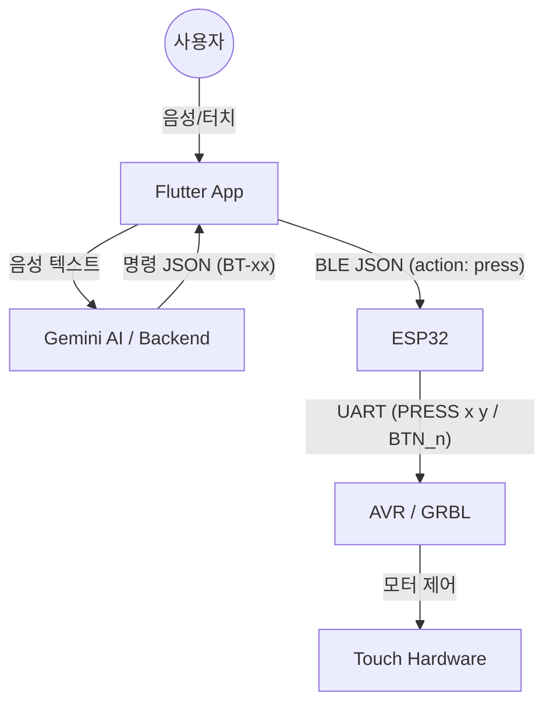

# Touch Bridge: AI 시스템 통합 가이드 (AI System Overview)

이 문서는 AI(Gemini, Claude 등)가 **Touch Bridge** 프로젝트의 전체 아키텍처, 하드웨어 연동 규약, 그리고 소프트웨어 로직을 빠르게 이해하고 협업할 수 있도록 돕기 위해 작성되었습니다.

---

## 1. 프로젝트 개요
**Touch Bridge**는 터치 패널이 장착된 가전제품(전자레인지, 세탁기 등)을 시각장애인이 음성이나 스마트폰 앱으로 쉽게 조작할 수 있도록 돕는 **비접촉 물리 인터페이스**입니다.

### 핵심 구성 요소
1.  **Flutter App**: 사용자 인터페이스, 음성 인식(STT), Gemini AI 연동, BLE 통신 담당.
2.  **Gemini AI**: 사용자의 자연어 입력을 분석하여 가전 조작 명령(버튼 ID 시퀀스)으로 변환.
3.  **ESP32 (BLE Bridge)**: 앱의 BLE 명령을 수신하여 UART 신호로 변환.
4.  **AVR/Arduino (Hardware Control)**: 모터(XY축, Z축 서보)를 제어하여 실제 물리적 터치를 수행.

---

## 2. 시스템 아키텍처


---

## 3. 하드웨어 세부 사양 (3단계 검증 구조)
프로젝트는 최적의 하드웨어 구조를 찾기 위해 세 가지 단계를 거치고 있습니다.

1.  **Step 1 (초슬림 키캡)**: MPR121 정전용량 센서와 릴레이를 이용한 가짜 터치 방식. (두께 5.1mm)
2.  **Step 2 (SG90 서보)**: 랙&피니언 방식의 XY 이동 + SG90 서보를 이용한 물리적 Z축 터치.
3.  **Step 3 (CoreXY 레일)**: NEMA14 스텝 모터와 솔레노이드를 이용한 정밀 타격 방식. (현재 주력 개발 단계)

---

## 4. 통신 프로토콜 (Protocol Contract)

### 4-1. 앱 -> ESP32 (BLE JSON)
앱에서 ESP32로 전송하는 데이터 포맷입니다.
- **Service UUID**: `0000FFE0-0000-1000-8000-00805F9B34FB`
- **Characteristic UUID**: `0000FFE1-0000-1000-8000-00805F9B34FB`

```json
{
  "action": "press",
  "button_id": "BT-05",
  "grid": { "x": 1, "y": 0 }
}
```

### 4-2. ESP32 -> AVR (UART Command)
ESP32가 하드웨어 컨트롤러로 전달하는 직렬 명령입니다.
- `BTN_<n>`: 1부터 시작하는 버튼 번호 (예: `BTN_1`)
- `BT-<n>`: 앱의 논리 버튼 ID 호환 (예: `BT-05`)
- `PRESS <x> <y>`: 0-index 기반 좌표 (예: `PRESS 1 2`)
- `SET_GRID <rows> <cols> ...`: 그리드 설정 (동적 그리드 대응용)

---

## 5. AI 로직 (Gemini Prompting)
`backend/prompts.py`에 정의된 AI는 다음과 같은 역할을 수행합니다.

- **의도 파악**: 사용자가 "만두 데워줘"라고 하면 "해동" 혹은 "2분 조리" 등의 적절한 시간을 유추.
- **버튼 매핑**: 유추된 동작을 표준 버튼 ID(`BT-xx`) 시퀀스로 변환.
    - `BT-01`: 10초 추가 / `BT-02`: 30초 추가 / `BT-03`: 1분 추가
    - `BT-05`: 시작 / `BT-06`: 취소
- **응답 형식**: 조리 시간(`inferred_seconds`), 안내 메시지(`message`)를 포함한 JSON 반환.

---

## 6. 가변 그리드 정책 (Dynamic Mapping)
가전제품마다 버튼 배치(2x2, 3x3 등)가 다르기 때문에 시스템은 다음 정보를 기기별로 관리합니다.

- `rows`, `cols`: 그리드 크기
- `originX`, `originY`: 첫 번째 버튼의 물리적 좌표
- `pitchX`, `pitchY`: 버튼 간의 간격
- `buttonMap`: 논리 ID(`BT-01`)와 물리 좌표(`{x, y}`)의 매핑 테이블

---

## 7. AI 협업 시 유의사항
1.  **고정 전제 금지**: 모든 가전이 3x3 그리드라고 가정하지 마세요. 반드시 `SET_GRID`와 매핑 테이블을 확인해야 합니다.
2.  **안전 우선**: `EMERGENCY_STOP` 명령은 가장 높은 우선순위를 가집니다.
3.  **피드백 루프**: 하드웨어에서 전송되는 `TOUCH_OK` 또는 `ERROR` 응답을 확인하여 앱 로그와 TTS로 사용자에게 알려야 합니다.

---
*최종 업데이트: 2026-05-21*
