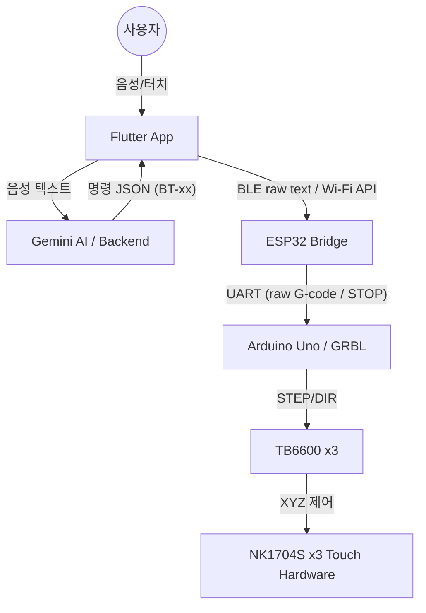

# Touch Bridge: AI 시스템 통합 가이드 (AI System Overview)

이 문서는 AI(Gemini, Claude 등)가 **Touch Bridge** 프로젝트의 전체 아키텍처, 하드웨어 연동 규약, 그리고 소프트웨어 로직을 빠르게 이해하고 협업할 수 있도록 돕기 위해 작성되었습니다.

---

## 1. 프로젝트 개요
**Touch Bridge**는 터치 패널이 장착된 가전제품(전자레인지, 세탁기 등)을 시각장애인이 음성이나 스마트폰 앱으로 쉽게 조작할 수 있도록 돕는 **비접촉 물리 인터페이스**입니다.

### 핵심 구성 요소
1.  **Flutter App**: 사용자 인터페이스, 음성 인식(STT), Gemini AI 연동, BLE/Wi-Fi 제어 명령 담당.
2.  **Gemini AI**: 사용자의 자연어 입력을 분석하여 가전 조작 명령(버튼 ID 시퀀스)으로 변환.
3.  **ESP32 (BLE/Wi-Fi Bridge)**: 앱의 BLE 또는 Wi-Fi 명령을 수신하여 Arduino Uno GRBL로 UART 전달.
4.  **Arduino Uno + GRBL (Motion Control)**: TB6600 드라이버와 NK1704S 스텝모터를 제어하여 XYZ 이동과 실제 물리적 터치를 수행.

---

## 2. 시스템 아키텍처


---

## 3. 하드웨어 세부 사양 (현재 개선 방향)

기존 28BYJ-48 기반 구조는 힘과 반복 정밀도에 한계가 있어, 현재는 다음 구조로 개선합니다.

1.  **X축**: NK1704S 42각 스텝모터 + TB6600
2.  **Y축**: NK1704S 42각 스텝모터 + TB6600
3.  **Z축**: NK1704S 42각 스텝모터 + TB6600
4.  **제어부**: Arduino Uno + GRBL 유지
5.  **통신부**: ESP32가 앱 명령을 수신하고 Arduino Uno로 UART 전달
6.  **전원부**: 모터는 12V 배럴잭 별도 전원, MCU와 공통 GND 구성

Z축은 실제 터치패널을 눌러야 하므로 스프링 완충, 하단 리미트 스위치, 전도성 터치팁을 함께 설계합니다.

---

## 4. 통신 프로토콜 (Protocol Contract)

### 4-1. 앱 -> ESP32 (BLE / Wi-Fi)
현재 앱은 BLE raw text 전송 경로를 구현하고 있습니다. 가정용 고정 장치 특성을 고려해 Wi-Fi HTTP/WebSocket 제어 API를 추가 검토합니다. Wi-Fi는 기본 제어/상태 모니터링에 유리하고, BLE는 초기 설정/복구/근거리 시연 경로로 유지합니다.
- **Service UUID**: `0000FFE0-0000-1000-8000-00805F9B34FB`
- **Characteristic UUID**: `0000FFE1-0000-1000-8000-00805F9B34FB`

```json
{
  "action": "press",
  "button_id": "BT-05",
  "grid": { "x": 1, "y": 0 }
}
```

### 4-2. ESP32 -> AVR (UART Command)
ESP32가 하드웨어 컨트롤러로 전달하는 직렬 명령입니다.
- 권장 경로: 앱 또는 ESP32가 만든 raw G-code를 Arduino Uno GRBL로 전달
- 레거시 경로: `BTN_<n>`, `BT-<n>`, `PRESS <x> <y>`, `SET_GRID <rows> <cols> ...`
- 개발자/수동 조이스틱: `$J` 또는 `G91` + `G1 <axis><value> F<feed>` + `G90`
- 비상정지: `STOP` 또는 GRBL 즉시 정지 명령을 최우선 처리

---

## 5. AI 로직 (Gemini Prompting)
`backend/prompts.py`에 정의된 AI는 다음과 같은 역할을 수행합니다.

- **의도 파악**: 사용자가 "만두 데워줘"라고 하면 "해동" 혹은 "2분 조리" 등의 적절한 시간을 유추.
- **버튼 매핑**: 유추된 동작을 표준 버튼 ID(`BT-xx`) 시퀀스로 변환.
    - `BT-01`: 10초 추가 / `BT-02`: 30초 추가 / `BT-03`: 1분 추가
    - `BT-05`: 시작 / `BT-06`: 취소
- **응답 형식**: 조리 시간(`inferred_seconds`), 안내 메시지(`message`)를 포함한 JSON 반환.
- **실행 우선순위**:
  1. 활성 기기의 `DeviceMappingProfile.buttonMap`과 `grid`를 우선 사용한다.
  2. 저장 매핑/그리드가 없을 때만 `docs/MOCK_MAPPING_DATA.md`의 검증된 데모 물리 좌표를 fallback으로 사용한다.
  3. AI는 좌표를 만들지 않고 논리 버튼 ID(`BT-xx`) 시퀀스만 만든다.
  4. 앱의 실행 서비스가 `BT-xx`를 X/Y/Z G-code 시퀀스로 변환한다.

---

## 6. 가변 그리드 정책 (Dynamic Mapping)
가전제품마다 버튼 배치(2x2, 3x3 등)가 다르기 때문에 시스템은 다음 정보를 기기별로 관리합니다.

- `rows`, `cols`: 그리드 크기
- `originX`, `originY`: 첫 번째 버튼의 물리적 좌표
- `pitchX`, `pitchY`: 버튼 간의 간격
- `buttonMap`: 논리 ID(`BT-01`)와 그리드 좌표(`{row, col}`)의 매핑 테이블
- `travelHeightZ`: 이동 중 터치팁 안전 높이
- `pressDepthZ`: 실제 누름 깊이
- `travelFeed`, `pressFeed`: 이동/누름 속도

---

## 7. AI 협업 시 유의사항
1.  **고정 전제 금지**: 모든 가전이 3x3 그리드라고 가정하지 마세요. 반드시 `SET_GRID`와 매핑 테이블을 확인해야 합니다.
2.  **안전 우선**: `EMERGENCY_STOP` 명령은 가장 높은 우선순위를 가집니다.
3.  **피드백 루프**: 하드웨어에서 전송되는 GRBL `ok`, `error`, `ALARM` 또는 터치 완료 응답을 확인하여 앱 로그와 TTS로 사용자에게 알려야 합니다.

---
*최종 업데이트: 2026-07-19*
